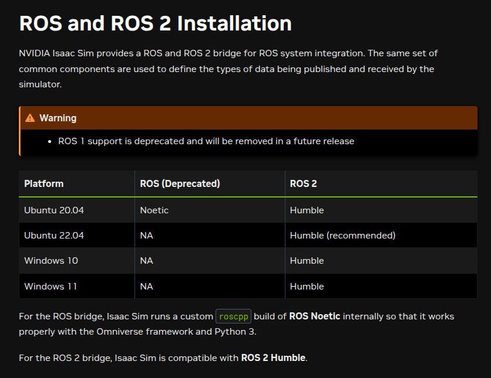

# NVIDIA Omniverse Cloud-based Environment

A guide to setting up a cloud-based NVIDIA Isaac Sim environment on AWS

---


## AWS Instance Manager

**EC2 Dashboard in AWS**: [https://console.aws.amazon.com/ec2/](https://console.aws.amazon.com/ec2/)

**Login Information**:
- Instance IP Address: e.g. `192.168.10.1`
- Username: `ubuntu`
- Key: `nvidia-omniverse.pem`
- You can use the key to SSH into the AWS instance: [`nvidia-omniverse.pem`](/path/to/the/key/file:nvidia-omniverse.pem)

**Set permissions for the key file**:
```bash
chmod 400 nvidia-omniverse.pem
```

**SSH into the instance**:
```bash
ssh -i nvidia-omniverse.pem ubuntu@instance-ip-address 
```

---

## GUI Access

The cloud instance does not include a GUI by default. To enable a graphical interface, you can install the Amazon DCV client for remote access via a web interface.

The instance has already been configured with a graphical desktop environment.

**Amazon DCV Client**:  
[https://www.amazondcv.com](https://www.amazondcv.com)

**Steps to create a DCV session**:
```bash
sudo systemctl start dcvserver
dcv create-session mysession --owner ubuntu
```

**After creating the DCV session**, access the console via:  
[https://instance-ip-address:8443](https://instance-ip-address:8443)

Alternatively, download the DCV client here:  
[https://www.amazondcv.com](https://www.amazondcv.com)

**Instance Details**:
- **Graphical Interface Address**: `https://instance-ip-address:8443`
- **Username**: `ubuntu`
- **Password**: `[user_password]`

---

## Confirm Infrastructure Information

Check Ubuntu release version:
```bash
lsb_release -a
```

Check NVIDIA driver and CUDA version:
```bash
nvidia-smi
```

---

## Install Isaac Sim Standalone

Installation Guide:  
[https://docs.isaacsim.omniverse.nvidia.com/4.5.0/installation/download.html](https://docs.isaacsim.omniverse.nvidia.com/4.5.0/installation/download.html)

Getting Started:  
[https://docs.isaacsim.omniverse.nvidia.com/4.5.0/introduction/quickstart_isaacsim.html](https://docs.isaacsim.omniverse.nvidia.com/4.5.0/introduction/quickstart_isaacsim.html)

Performance Optimization Handbook:  
[https://docs.isaacsim.omniverse.nvidia.com/4.5.0/reference_material/sim_performance_optimization_handbook.html](https://docs.isaacsim.omniverse.nvidia.com/4.5.0/reference_material/sim_performance_optimization_handbook.html)

---

## Build a Simple Robot in Isaac Sim

[https://docs.isaacsim.omniverse.nvidia.com/4.5.0/gui/tutorial_gui_simple_robot.html](https://docs.isaacsim.omniverse.nvidia.com/4.5.0/gui/tutorial_gui_simple_robot.html)

---

## Driving the Robot via ROS 2 Message

[https://docs.isaacsim.omniverse.nvidia.com/4.5.0/ros2_tutorials/tutorial_ros2_turtlebot.html#isaac-sim-app-tutorial-ros2-turtlebot](https://docs.isaacsim.omniverse.nvidia.com/4.5.0/ros2_tutorials/tutorial_ros2_turtlebot.html#isaac-sim-app-tutorial-ros2-turtlebot)

---

## ROS and ROS 2 Bridge

The **ROS 2 Bridge** is enabled by default when running `isaac-sim.sh`.

### ROS Versions Support


- **ROS 1**: Isaac Sim uses a custom `roscpp` build of **ROS Noetic** for compatibility with the Omniverse framework and Python 3.
- **ROS 2**: Compatible with **ROS 2 Humble**.

> ⚠️ **Warning**  
> ROS 1 support is deprecated and will be removed in a future release.

### Running ROS Without System-Level Install

If ROS is not installed on the system, internal ROS libraries bundled with Isaac Sim can be enabled.

Full Installation Guide:  
[https://docs.isaacsim.omniverse.nvidia.com/4.5.0/installation/install_ros.html#ros-and-ros-2-installation](https://docs.isaacsim.omniverse.nvidia.com/4.5.0/installation/install_ros.html#ros-and-ros-2-installation)

---

## ROCKER: Running ROS in Docker Containers

GitHub Repo: [https://github.com/osrf/rocker](https://github.com/osrf/rocker)

Run ROS 2 container with GPU and GUI support:
```bash
rocker --nvidia --x11 --privileged --network host --name <container_name> osrf/ros:humble-desktop-full-jammy
```

---
